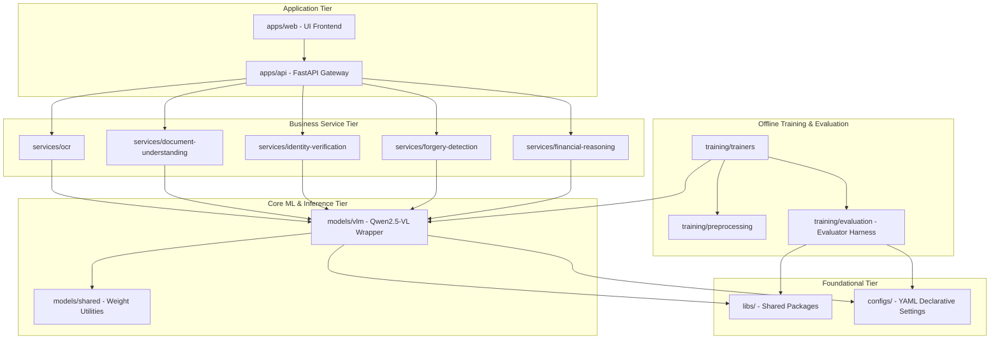
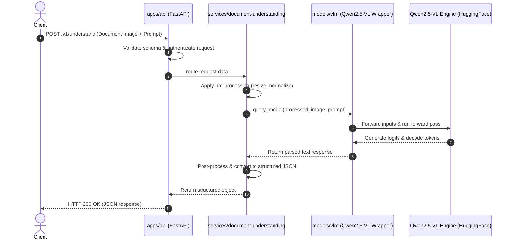

# 🏛️ VeriDoc AI — Architecture Overview

VeriDoc AI is designed around a **Modular Multi-Tier Monorepo** architecture. This pattern isolates core machine learning research and training workloads from deployable application tiers and business logic services. This structure ensures high portability, testability, and operational efficiency.

---

## 🏗️ High-Level System Architecture

The codebase is divided into five distinct structural layers. Each layer has a well-defined dependency direction: **Tiers only depend on layers below them (e.g., Apps -> Services -> Models -> Libs).**

---

## 📂 Component Breakdown

### 1. Application Tier (`apps/`)
*   **Role**: Exposes the platform to clients.
*   **Structure**:
    *   `api/`: FastAPI web server providing REST endpoints, request validation, authentication, and routing.
    *   `web/`: Web dashboard/UI for visual document upload and verification.
    *   `admin/`: Management panel for model deployment status and system monitoring.

### 2. Business Capabilities (`services/`)
*   **Role**: Encapsulates specific domain workflows.
*   **Design**: Every service inherits standard patterns but executes distinct logic:
    *   `ocr/`: Text extraction and layout parsing.
    *   `document-understanding/`: Natural language reasoning over document content.
    *   `identity-verification/`: KYC, facial matching, and official document checks.
    *   `forgery-detection/`: Manipulation detection, image analysis, and metadata verification.
    *   `financial-reasoning/`: Parsing bank statements and tax documents.

### 3. Core Models & Inference (`models/`)
*   **Role**: Manages model execution, inference parameters, and tokenization.
*   **Structure**:
    *   `vlm/`: Wrappers for Vision-Language Models (e.g., `Qwen2.5-VL-3B-Instruct`), handling prompt structuring and tensor formatting.
    *   `ocr/`: Light-weight models for fast text detection and OCR.
    *   `shared/`: Utilities for handling weights, checkpoint downloading, and quantization profiles (e.g., bitsandbytes configuration).

### 4. Training Infrastructure (`training/`)
*   **Role**: Houses offline routines for dataset creation, preprocessing, training, and metrics reporting.
*   **Key Components**:
    *   `preprocessing/`: Formats raw document images into tensors or token sequences.
    *   `trainers/`: LoRA/PEFT fine-tuning loops built using PyTorch and Hugging Face.
    *   `evaluation/`: Implements the evaluation harness. The [BaseEvaluator](file:///c:/Users/Mohmmed%20Aarif/projects/Ai%20ComputerVision/veridoc-ai/training/evaluation/evaluator.py) evaluates a model against structured datasets, logging results via [metrics.py](file:///c:/Users/Mohmmed%20Aarif/projects/Ai%20ComputerVision/veridoc-ai/training/evaluation/metrics.py) (e.g., token-level F1 and Exact Match).

### 5. Shared Libraries & Configs (`libs/` & `configs/`)
*   **Role**: Provides common utilities and declarative setups.
*   **Libraries (`libs/`)**: Cross-cutting code such as standardized error classes, logging formats, and telemetry helpers.
*   **Configurations (`configs/`)**: Declarative configuration definitions (environments, models, training pipelines) mapping parameters to runtime components.

---

## 🔄 Core Data Flows

### A. Inference Data Flow (Online)

### B. Dataset Creation & Training Data Flow (Offline)
1.  **Ingestion**: Raw data is downloaded and placed into [data/raw/](file:///c:/Users/Mohmmed%20Aarif/projects/Ai%20ComputerVision/veridoc-ai/data/raw).
2.  **Manifest Registration**: Dataset managers write a manifest file matching the [schema.json](file:///c:/Users/Mohmmed%20Aarif/projects/Ai%20ComputerVision/veridoc-ai/data/manifests/schema.json) specification.
3.  **Preprocessing**: Pipelines read the manifest, load images, run OCR or tokenization, and output tensors to [data/processed/](file:///c:/Users/Mohmmed%20Aarif/projects/Ai%20ComputerVision/veridoc-ai/data/processed).
4.  **Training**: The trainer runs the training loop, loading configuration files from [configs/training/](file:///c:/Users/Mohmmed%20Aarif/projects/Ai%20ComputerVision/veridoc-ai/configs/training) and logging runs to Weights & Biases (W&B).
5.  **Evaluation**: The [BaseEvaluator](file:///c:/Users/Mohmmed%20Aarif/projects/Ai%20ComputerVision/veridoc-ai/training/evaluation/evaluator.py) processes the checkpoint against [data/processed/test](file:///c:/Users/Mohmmed%20Aarif/projects/Ai%20ComputerVision/veridoc-ai/data/processed) split, reporting scores using metrics in [metrics.py](file:///c:/Users/Mohmmed%20Aarif/projects/Ai%20ComputerVision/veridoc-ai/training/evaluation/metrics.py).

---

## ⚖️ Key Design Decisions & Trade-offs

### 1. Separation of serving from training code
*   **Trade-off**: The training environment requires heavy GPU dependencies (like PyTorch, DeepSpeed, PEFT), whereas serving can run on lightweight runtimes or specialized inference servers.
*   **Decision**: Serving wrappers (`models/`) are kept lightweight and imported by `services/`. All training code resides strictly inside `training/`. This ensures FastAPI container images remain small and scale quickly.

### 2. Manifest-Driven Datasets
*   **Trade-off**: Managing raw files across developers leads to path issues and dataset drift.
*   **Decision**: Every dataset must have a `manifest.json` compliant with [schema.json](file:///c:/Users/Mohmmed%20Aarif/projects/Ai%20ComputerVision/veridoc-ai/data/manifests/schema.json). This guarantees consistency in train/validation/test splits across local machines and cloud GPU instances.
