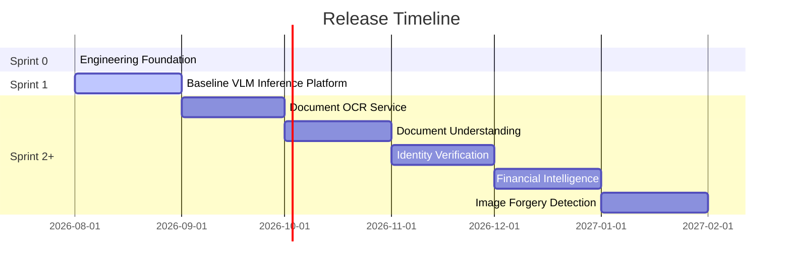

# VeriDoc AI — Product Roadmap

VeriDoc AI is an enterprise-grade document intelligence platform that transforms unstructured documents into reliable, actionable, and secure business intelligence. This document defines the roadmap, current milestones, and execution status of the platform.

---

## 🗺️ Release Roadmap

### Milestone Release Summary

| Version | Milestone Name | Focus & Primary Capabilities | Status |
| :--- | :--- | :--- | :--- |
| **v0.1** | Engineering Foundation | Developer environment, CI/CD, linting, testing, and ML tooling baseline. | Completed |
| **v0.2** | Baseline VLM Inference Platform | Establish the first end-to-end inference pipeline for a Vision-Language Model. | **Active** |
| **v0.3** | Document Understanding | Vision-Language Model fine-tuning, retrieval-augmented generation (RAG) over docs. | Planned |
| **v0.4** | Identity Verification | KYC assistance, ID card verification, and automatic classification. | Planned |
| **v0.5** | Financial Intelligence | Parsing financial statements, balance sheets, and context-aware reasoning. | Planned |
| **v0.6** | Image Forgery Detection | Fraud detection, document tampering identification, and metadata verification. | Planned |
| **v1.0** | Enterprise Launch | Unified API endpoint, security compliance, administration panel, and web UI. | Planned |

---

## 📍 Current Milestone: Release v0.2 — Baseline VLM Inference Platform (Sprint 1)

For the detailed task backlog, estimates, and acceptance criteria, see the [Sprint 1 Board](file:///c:/Users/Mohmmed%20Aarif/projects/Ai%20ComputerVision/veridoc-ai/docs/product/sprint_1_board.md).

### In Progress Features
*   **F1.1 Model Evaluation & Selection**: Evaluate candidate VLMs, select baseline model, create Model Card, and define inference strategy.
*   **F1.2 Baseline Inference Pipeline**: Implement model loader, build image processing, implement inference engine, and run memory optimization (quantization).
*   **F1.3 API Layer**: Initialize FastAPI, implement prediction and health check endpoints with validation.
*   **F1.4 Sprint Demo**: Deploy end-to-end VLM document understanding flow and write technical documentation.

---

## 🏆 Completed Milestones

### Release v0.1 — Engineering Foundation
*   **F0.1 Repository Foundation**: Modular multi-tier directory structure.
*   **F0.2 Project Management**: Issue templates and PR guidelines.
*   **F0.3 Development Environment**: Lockfile pinning via `uv`.
*   **F0.4 Code Quality**: Auto-formatting and checking with Ruff.
*   **F0.5 CI/CD**: Automatic lint check and pytest suite running on GitHub Actions.
*   **F0.6 ML Engineering Foundation**: Dataset directory structure, configuration management, dataset manifest schema, evaluation harness scaffolding, and experiment management.
*   **F0.7 Documentation**: Documentation structure, architecture overview, and development guide.
