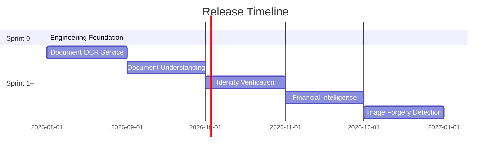

# VeriDoc AI — Product Roadmap

VeriDoc AI is an enterprise-grade document intelligence platform that transforms unstructured documents into reliable, actionable, and secure business intelligence. This document defines the roadmap, current milestones, and execution status of the platform.

---

## 🗺️ Release Roadmap

### Milestone Release Summary

| Version | Milestone Name | Focus & Primary Capabilities | Status |
| :--- | :--- | :--- | :--- |
| **v0.1** | Engineering Foundation | Developer environment, CI/CD, linting, testing, and ML tooling baseline. | **Active** |
| **v0.2** | Document OCR Service | Local and cloud-based OCR engine integrations, layout parsing, and text extraction. | Planned |
| **v0.3** | Document Understanding | Vision-Language Model fine-tuning, retrieval-augmented generation (RAG) over docs. | Planned |
| **v0.4** | Identity Verification | KYC assistance, ID card verification, and automatic classification. | Planned |
| **v0.5** | Financial Intelligence | Parsing financial statements, balance sheets, and context-aware reasoning. | Planned |
| **v0.6** | Image Forgery Detection | Fraud detection, document tampering identification, and metadata verification. | Planned |
| **v1.0** | Enterprise Launch | Unified API endpoint, security compliance, administration panel, and web UI. | Planned |

---

## 📍 Current Milestone: Release v0.1 — Engineering Foundation

### Completed Features
*   **F0.1 Repository Foundation**: Modular multi-tier directory structure (`apps/`, `services/`, `libs/`, `models/`, `training/`).
*   **F0.2 Project Management**: Standard issue templates (`bug.yml`, `feature.yml`, `task.yml`) and pull request guidelines.
*   **F0.3 Development Environment**: Lockfile pinning and package management via `uv`.
*   **F0.4 Code Quality**: Auto-formatting and checking with Ruff (configured in `ruff.toml`).
*   **F0.5 CI/CD**: Automatic lint check and pytest suite running on GitHub Actions with README status badge.
*   **F0.7 Documentation**: Created documentation structure, architecture overview, and development guide.

### In Progress Features
*   **F0.6 ML Engineering Foundation**:
    *   T0.6.1 Dataset Directory Structure
    *   T0.6.3 Configuration Management
    *   T0.6.5 Dataset Manifest Standard
    *   T0.6.4 Evaluation Harness Scaffolding
    *   T0.6.2 Experiment Management

---

## 🔮 What Comes Next (Release v0.2 / Sprint 1)

### Feature F1.1 – Baseline Vision-Language Model
The first end-to-end model development cycle:
1.  **Baseline Selection**: Adopt `Qwen2.5-VL-3B-Instruct` as our starting Vision-Language Model.
2.  **Training Pipeline**: Set up deep learning code using Hugging Face/PyTorch.
3.  **Fine-Tuning**: Adapt the model to document layout parsing and extraction tasks.
4.  **Evaluation**: Implement the v0.1 evaluation harness to measure metrics.
5.  **Inference Serving**: Wrap the model using FastAPI to expose a production-ready HTTP endpoint.
